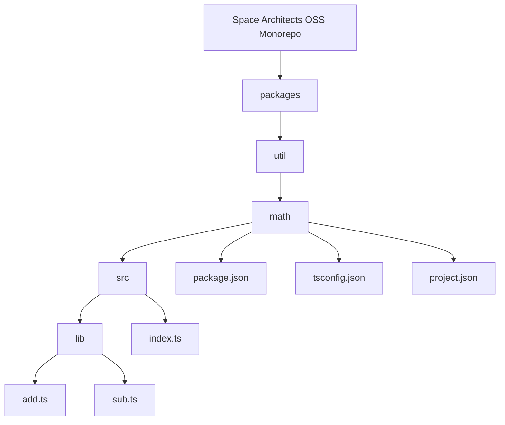

# Space Architects OSS Monorepo

## Project structure

```mermaid
graph TD
    A[Space Architects OSS Monorepo] --> B[packages]
    B --> C[util]
    C --> D[math]
    D --> E[src]
    E --> F[lib]
    F --> G[add.ts]
    F --> H[sub.ts]
    E --> I[index.ts]
    D --> J[package.json]
    D --> K[tsconfig.json]
    D --> L[project.json]

```